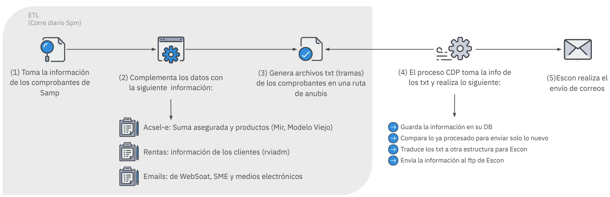
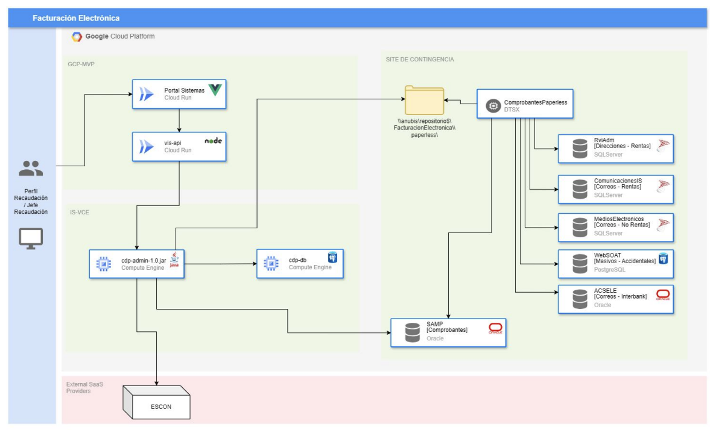
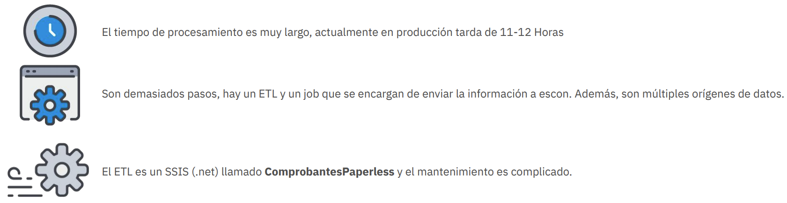

# Proceso de Facturación Electrónica

##### Actualmente el proceso de facturación electrónica es un ETL que se encarga de tomar la información de Samp, Acsel-e, MIR, Modelo Viejo de reportes y Rviadm para realizar en envío de los comprobantes a los clientes. Actualmente realiza lo siguiente:
 

### Este es el HDL del proceso actual
 

### Actualmente el proceso de facturación electrónica tiene los siguientes problemas: 
 

### Lo que se necesita es una solución viable al problema de facturación electrónica, donde el proceso debe ser en línea ó durar muy poco para el envío de comprobantes a los clientes.

## Solución Propuesta

### Descozco algunos actores del proceso descrito, pero hare una propuesta de solución basada en la información que tengo, si me pueden corregir en caso de que me equivoque en algo, se los agradecería.

> La facturacion electronica en linea suele ser un proceso un poco tedioso por que existen factores extenos que
> pueden afectar el proceso, como la conexion a internet, la disponibilidad de los servicios del Operador de 
> Servicios Electrónicos (OSE-SEE) para que pueda hacer efectivo la emision y envio a la SUNAT. 

### La solución rapida:
 
> Crear un webhook que sea llamado ni bien el servicio de PAPERLESS  termina de procesar una factura, 
> asi evitas que el sistema CDP tenga que correr el batch para traer la informacion del repositorio de ANUBIS, 
> tendria que ser un servicio de colas con memoria o un servicio de colas con persistencia, para que no se pierda la data,
> asi conviertes el proceso de facturacion electronica en un proceso en linea.

### La solución a largo plazo:

> Desarrollar un conjunto de microservicios que se encarguen de la facturación electrónica, de manera distribuida y escalable. 
> Tenemos como repositorio central de datos a SAMP y que los demas servicios son de apoyo para completar la informacion necesaria.
> Entonces cuando llegue una venta a SAMP, genera un callback de emisionn de factura electronica, que se ejecuta en background, 
> haciendo asi el proceso de emision de factura electronica mas eficiente y rapido, sobre todo que es asincrono.
> Si algun alguna venta no se puede emitir la factura electronica, se marca como pendiente de emision para que luego de una tiempo prudente puede ser reprocesado.

Att, Yahyr Paredes.

